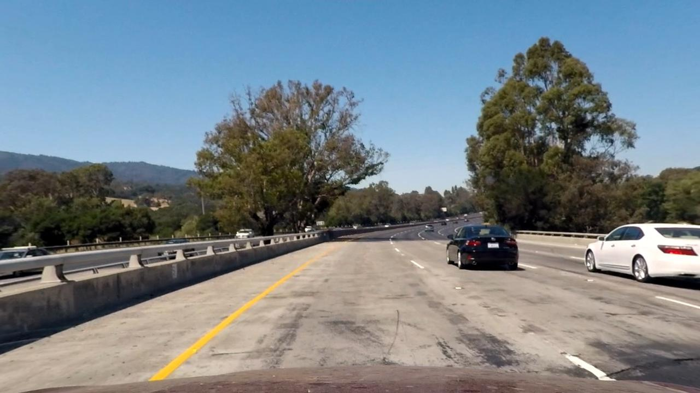

#Advanced Lane Finding Project
#### [Rubric](https://review.udacity.com/#!/rubrics/571/view) Points
The goals / steps of this project are the following:

* Compute the camera calibration matrix and distortion coefficients given a set of chessboard images.
* Apply a distortion correction to raw images.
* Use color transforms, gradients, etc., to create a thresholded binary image.
* Apply a perspective transform to rectify binary image ("birds-eye view").
* Detect lane pixels and fit to find the lane boundary.
* Determine the curvature of the lane and vehicle position with respect to center.
* Warp the detected lane boundaries back onto the original image.
* Output visual display of the lane boundaries and numerical estimation of lane curvature and vehicle position.

###Here I will consider the rubric points individually and describe how I addressed each point in my implementation.  

---

###Camera Calibration

####1. Briefly state how you computed the camera matrix and distortion coefficients. Provide an example of a distortion corrected calibration image.

The code for this step is contained in the IPython notebook located in "./CameraCalibration.ipynb". 

I start by preparing "object points", which will be the (x, y, z) coordinates of the chessboard corners in the world. Here I am assuming the chessboard is fixed on the (x, y) plane at z=0, such that the object points are the same for each calibration image.  Thus, `objp` is just a replicated array of coordinates, and `objpoints` will be appended with a copy of it every time I successfully detect all chessboard corners in a test image.  `imgpoints` will be appended with the (x, y) pixel position of each of the corners in the image plane with each successful chessboard detection.  

I then used the output `objpoints` and `imgpoints` to compute the camera calibration and distortion coefficients using the `cv2.calibrateCamera()` function.  I applied this distortion correction to the test image using the `cv2.undistort()` function and obtained this result: 

Original Image                 |  Undistorted Image
:----------------------------:|:------------------------------:
| 

###Pipeline (single images)

####1. Provide an example of a distortion-corrected image.
To correct a test image for distortion, I use the`cv2.undistort()` function along with the camera calibration obtained in the previous step and obtained this result:

Original Image                 |  Undistorted Image
:----------------------------:|:------------------------------:
| 

####2. Describe how (and identify where in your code) you used color transforms, gradients or other methods to create a thresholded binary image.  Provide an example of a binary image result.
I used a combination of color and gradient thresholds to generate a binary image. I tried quite a few different versions of applying gradients and/or thresholding on different color channels from different color spaces. Some examples of my experiments can be found in the `3.1. Gradient Thresholding` and `3.2. Color Channel Thresholding` sections in the [LaneDetectionPipeline](LaneDetectionPipeline.ipynb) notebook. 

My final version (see section `3.3. Final Thresholding Pipeline` in the notebook) combines several approches
- The top part of the image lower than some `vertical_limit` (containing mostly sky and horizon) is ignored.
- Sobel x/y gradients are thresholded (on the u- and v- channels from the yuv color space and the s channel from the hls color space).
- Yellow pixels are extracted from the hsv colorspace.
- A percentile of the pixels in the image (those with the highest intensity) are extracted (to obtain white markings).

Here's an example of my output for this step. 

Original Image                 |  Binary Image
:----------------------------:|:------------------------------:
| 

Birdseye View                 |  Binary Birdseye View
:----------------------------:|:------------------------------:
| 

####3. Describe how (and identify where in your code) you performed a perspective transform and provide an example of a transformed image.

The code for my perspective transform can be found in the `2. Perspective Transform` Section of my [LaneDetectionPipeline](LaneDetectionPipeline.ipynb) notebook.  I chose the hardcode the source and destination points to the following coordinates and used the openCV functionality to generate a transformation matrix and perform the warping.

| Source        | Destination   | 
|:-------------:|:-------------:| 
| 280, 667      | 300, 710        | 
| 580, 460      | 300, 200      |
| 700, 460     | 980, 200      |
| 1000, 667      | 980, 710      |

I verified that my perspective transform was working as expected by drawing the Source and Destination points onto a test image (containing straight lines) and the birdseye view counterpart to verify that the lines appear parallel in the warped image. Here's an example of a straight line test image and the transformed version of it:

Original Image                 |  Birdseye View
:----------------------------:|:------------------------------:
| 

####4. Describe how (and identify where in your code) you identified lane-line pixels and fit their positions with a polynomial?

The code for this task is found in the section`4.1 Identify Lane-Line Pixels and Fit Polynomial`. *(Note: some of the code for is taken from the classroom examples)*.
The approach is twofold:
- If there is no prior fit of a lane line, I use the sliding windows approach to find lane-line pixels and fit a 2nd order polynomial.
- If there is a prior fit of lane lines, I replace the sliding windows approach with a margin around the prior fit and fit the polynomial to the pixels found in this way.
Here's an exampe of a binarized warped image with identified lane-line pixels and fitted polynomials:

sliding window                 |  using previous fit
:----------------------------:|:------------------------------:
| 

####5. Describe how (and identify where in your code) you calculated the radius of curvature of the lane and the position of the vehicle with respect to center.

Section`4.2 Measuring Curvature and Vehicle Offset` contains the computation of curvature and the vehicle offset from the lane center.
- The computation of the curvature assumes a circular curve in the road and returns a radius of this circle in meters. 
- The computation of the offset from the lane center assumes that the camera is mounted centered on the car. The lane center is computed as the average of the two polynomials for the left and right lane markings. The offset is then computed as the difference between the image center coordinate (in x dimension) and the lane center (in image coordinates at the bottom of the image, y=719) and then scaled into world coordinates (unit is meters).

####6. Provide an example image of your result plotted back down onto the road such that the lane area is identified clearly.

I implemented this step in section 4.3. Here is an example of my result on a test image:

---

###Pipeline (video)

####1. Provide a link to your final video output.  Your pipeline should perform reasonably well on the entire project video (wobbly lines are ok but no catastrophic failures that would cause the car to drive off the road!).

Here's a [link to my video result](https://youtu.be/CZWhJLUduZY)

---

###Discussion

####1. Briefly discuss any problems / issues you faced in your implementation of this project.  Where will your pipeline likely fail?  What could you do to make it more robust?

While my current implementation can handle the project video very well, there are several failure conditions in its current state:
- Since there is only one single parameter setting for the thresholding, even with using various color spaces the algorithm will still be suceptible to particularly strong illumination changes or reflections in the windshield (as in the hard challenge video). Even though I undertook a fair amount of experimentation, the final choice still seems somewhat arbitrary.
- Another failure condition category is particularly strong or varying corners. In strong corners one of the lane line markers may simply lie outside of the field of view of the centered camera. This could be remedied by using additional side oriented camera images, whose images coudl be stiched together with the front-facing camera. Regarding varying corners, the 2nd degree polynomial currently used to fit to the lane markings can only fit curvatures in one direction, i.e. either to the left or the right. It will not be able to handle tight s-curves that change direction of the curvature within the examined region. To be able to compe with this scenario one could instead use higher order polynomials or cubic spline interpolation.
- I have not yet added a moving average on the polynomial fit to the lane lines, but operate mostly on a per frame basis. Adding the averaging would help smoothen out slight failures and jitter.

Generally speaking, I would also be very interested to try to solve the segmentation problem of finding the lane lines using the Deep Learning approach.